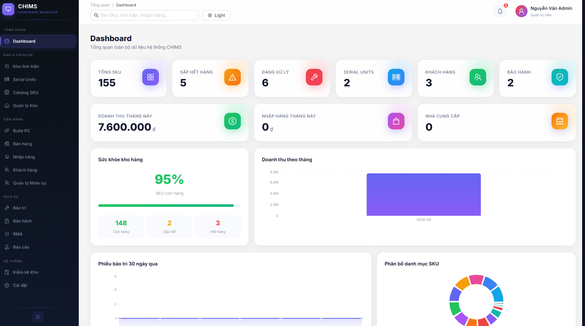
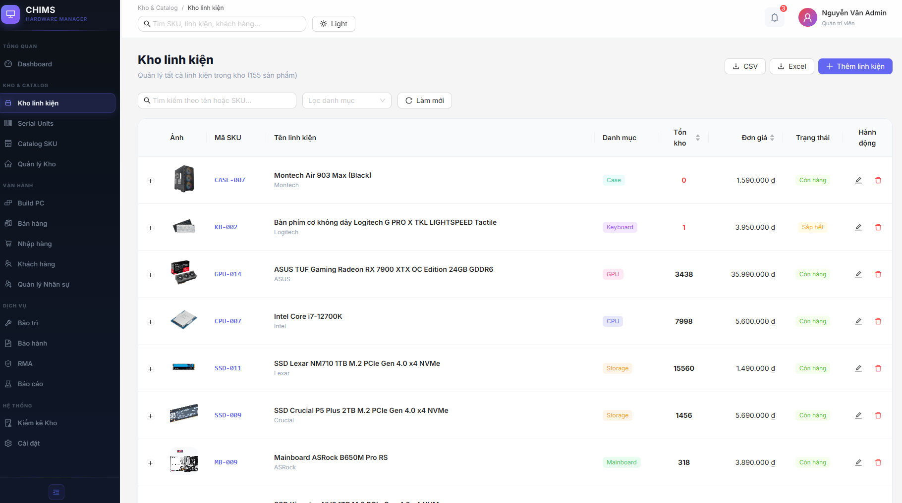
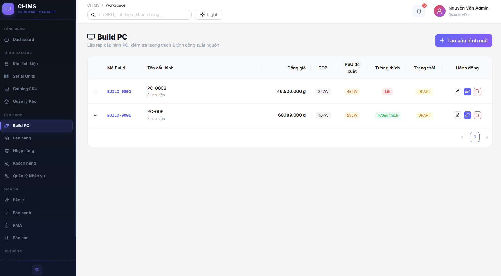
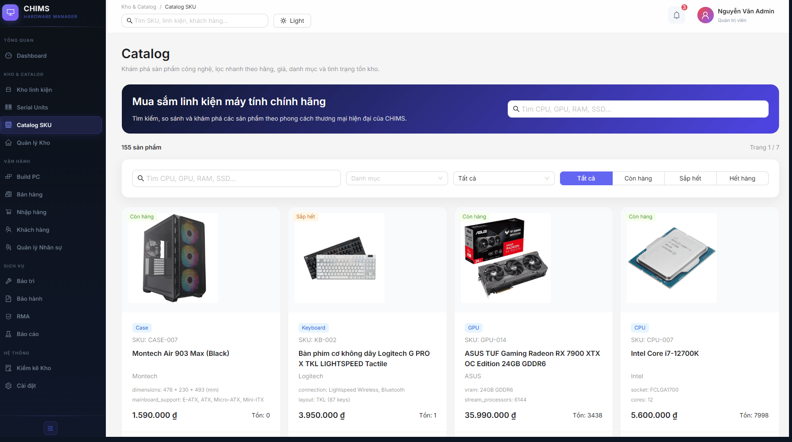
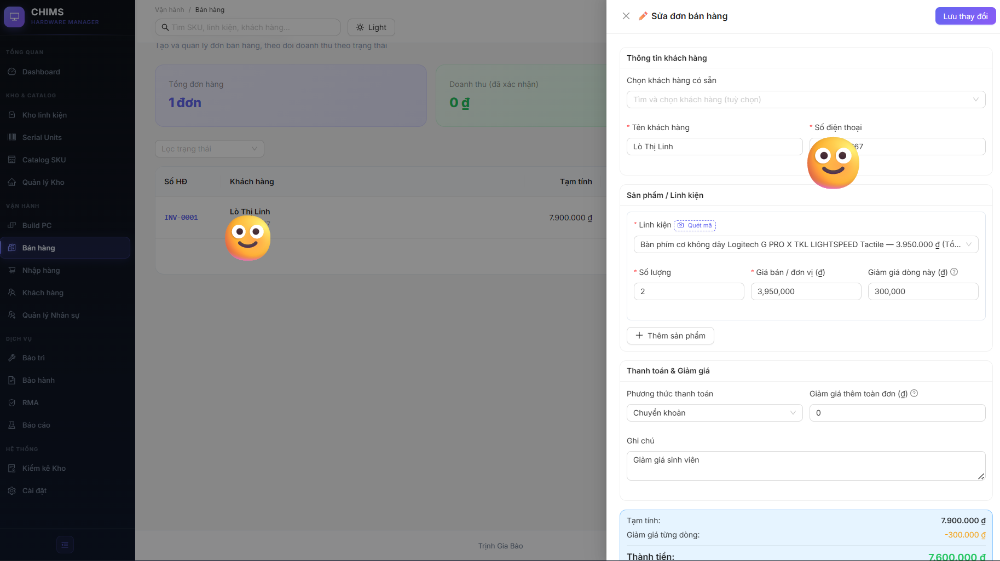
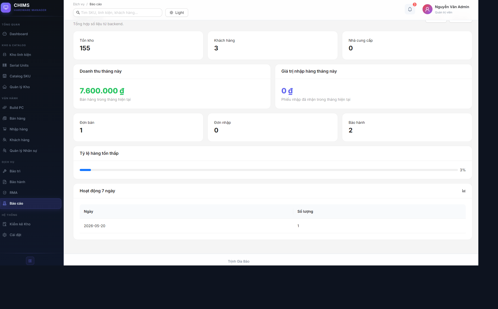

# CHIMS — Computer Hardware Inventory & Management System

> Hệ thống quản lý kho phần cứng máy tính dành cho doanh nghiệp bán lẻ, được xây dựng với FastAPI + Next.js + MongoDB.

<!-- BANNER IMAGE -->
<!--  -->

[](https://www.gnu.org/licenses/gpl-3.0)
[](https://python.org)
[](https://fastapi.tiangolo.com)
[](https://nextjs.org)
[](https://www.mongodb.com/atlas)

---

## 🌐 Triển khai (Deployment)

| Dịch vụ | Nền tảng | URL |
|---|---|---|
| **Frontend** | Vercel | [](https://chims-ten.vercel.app/) |
| **Backend API** | Render | [](https://chims-backend.onrender.com) |
| **API Docs** | Render (Swagger) | [](https://chims-backend.onrender.com/docs) |

---

## 🔑 Tài khoản Demo (Chỉ xem)

Để phục vụ quá trình đánh giá, chấm điểm và xem trực quan của nhà trường hoặc nhà tuyển dụng, hệ thống hỗ trợ tài khoản Demo đặc biệt với quyền xem đầy đủ chức năng nhưng không thể phá hoại dữ liệu:

* **Tên đăng nhập**: `demo`
* **Mật khẩu**: `demo123`
* **Vai trò**: Quản trị viên (Admin) — Chỉ có quyền xem (Read-only)

> 💡 **Cơ chế hoạt động:** Giao diện hiển thị đầy đủ tất cả chức năng quản lý nâng cao của Admin (Dashboard, Nhân viên, Kho hàng, Hoá đơn, PC Builder, v.v.). Tuy nhiên, mọi thao tác sửa đổi dữ liệu (Thêm mới, Xóa, Cập nhật) gửi tới Backend đều bị chặn lại và trả về thông báo lỗi: *"Tài khoản demo chỉ có quyền xem, không thể thực hiện thao tác này."* nhằm bảo vệ tính toàn vẹn dữ liệu mẫu.

---

## 📋 Mục lục

- [Giới thiệu](#-giới-thiệu)
- [Tính năng](#-tính-năng)
- [Kiến trúc hệ thống](#-kiến-trúc-hệ-thống)
- [Công nghệ sử dụng](#-công-nghệ-sử-dụng)
- [Cài đặt & Chạy thử](#-cài-đặt--chạy-thử)
- [Cấu hình môi trường](#-cấu-hình-môi-trường)
- [API Endpoints](#-api-endpoints)
- [Cấu trúc thư mục](#-cấu-trúc-thư-mục)
- [Screenshot](#-screenshot)
- [Tác giả](#-tác-giả)
- [Giấy phép](#-giấy-phép)

---

## 🖥️ Giới thiệu

**CHIMS** (Computer Hardware Inventory & Management System) là một nền tảng quản lý doanh nghiệp toàn diện dành cho các cửa hàng và công ty kinh doanh phần cứng máy tính. Hệ thống cung cấp:

- Quản lý tồn kho SKU với theo dõi số serial từng thiết bị
- Quy trình bán hàng, mua hàng và bảo hành tích hợp
- Xây dựng cấu hình PC với phân tích tương thích bằng AI
- Dashboard phân tích kinh doanh theo thời gian thực
- Hệ thống RMA (Return Merchandise Authorization) và bảo trì

---

## ✨ Tính năng

### 📦 Quản lý Kho hàng (Inventory)
- Quản lý SKU với đầy đủ thông tin: giá bán, giá vốn, số lượng tồn, vị trí lưu kho
- Phân loại theo danh mục: CPU, GPU, RAM, Storage, Mainboard, PSU, Case, Cooling, Monitor, Peripheral
- Cảnh báo tồn kho thấp (dưới mức `min_stock`)
- Upload và quản lý nhiều ảnh sản phẩm
- Thông số kỹ thuật (specs) linh hoạt dạng key-value

### 🔢 Theo dõi Số Serial (Serial Units)
- Gán số serial riêng biệt cho từng đơn vị hàng hóa
- Theo dõi trạng thái: `in_stock`, `sold`, `rma`, `scrapped`
- Lịch sử chuyển trạng thái đầy đủ

### 🛒 Bán hàng (Sales)
- Tạo đơn bán hàng với nhiều sản phẩm
- Liên kết đơn hàng với khách hàng
- Theo dõi trạng thái thanh toán và giao hàng
- Tự động giảm tồn kho khi xác nhận đơn

### 🛍️ Mua hàng (Purchase Orders)
- Tạo đơn nhập hàng từ nhà cung cấp
- Theo dõi trạng thái: `draft`, `ordered`, `received`, `cancelled`
- Tự động tăng tồn kho khi nhận hàng

### 👥 Quản lý Khách hàng & Nhà cung cấp
- Lưu trữ thông tin liên lạc, địa chỉ, lịch sử mua hàng
- Phân loại và tìm kiếm nhanh

### 🖥️ Xây dựng cấu hình PC (PC Build)
- Chọn linh kiện từ kho tồn tại và build thành cấu hình hoàn chỉnh
- Kiểm tra tương thích tự động: socket CPU/Mainboard, TDP, PSU, RAM type
- **Phân tích AI** bằng GroqCloud (Llama 3.3 70B) — nhận xét bằng tiếng Việt
- Lưu cấu hình để tái sử dụng và báo giá

### 🔧 Bảo trì & Sửa chữa (Maintenance)
- Tạo phiếu yêu cầu bảo trì (ticket) với mô tả lỗi
- Phân công kỹ thuật viên và theo dõi tiến độ
- Lịch sử sửa chữa cho từng thiết bị

### 🔄 RMA (Return Merchandise Authorization)
- Quy trình xử lý hàng trả hàng đầy đủ
- Theo dõi lý do, trạng thái và kết quả xử lý (đổi mới, hoàn tiền, sửa chữa)

### 🛡️ Bảo hành (Warranty)
- Quản lý phiếu bảo hành theo serial number
- Tính toán ngày hết hạn bảo hành tự động
- Kiểm tra tình trạng bảo hành nhanh theo SKU hoặc serial

### 🏭 Quản lý Kho vật lý (Warehouse)
- Quản lý nhiều kho/chi nhánh
- Theo dõi vị trí lưu trữ (kệ, hàng, cột)
- Điều chuyển hàng giữa các kho

### 📊 Kiểm kê & Thanh lý (Audit)
- Tạo phiên kiểm kê định kỳ
- So sánh số lượng thực tế với số lượng hệ thống
- Ghi nhận hàng dư/thiếu và đề xuất thanh lý

### 📈 Dashboard & Báo cáo
- Tổng quan doanh thu, lợi nhuận, đơn hàng theo thời gian thực
- Biểu đồ doanh thu theo danh mục, top SKU bán chạy
- Cảnh báo tồn kho thấp và hàng sắp thanh lý
- Xuất báo cáo Excel / PDF

### 📖 Catalog sản phẩm
- Trang catalog công khai dạng lưới ảnh
- Tìm kiếm, lọc theo danh mục và khoảng giá
- Trang chi tiết sản phẩm với thông số kỹ thuật đầy đủ

---

## 🏗️ Kiến trúc hệ thống

```
┌─────────────────────────────────────────────┐
│               Frontend (Next.js 15)          │
│  ┌──────────┐ ┌──────────┐ ┌─────────────┐  │
│  │Dashboard │ │Inventory │ │  PC Builder  │  │
│  │ Reports  │ │  Sales   │ │  AI Analyze  │  │
│  └──────────┘ └──────────┘ └─────────────┘  │
└──────────────────┬──────────────────────────┘
                   │ HTTP / REST API
┌──────────────────▼──────────────────────────┐
│              Backend (FastAPI)               │
│  ┌──────────┐ ┌──────────┐ ┌─────────────┐  │
│  │Auth/JWT  │ │ API Routes│ │ AI Service  │  │
│  │          │ │  (17+)   │ │  (GroqCloud) │  │
│  └──────────┘ └──────────┘ └─────────────┘  │
└──────────────────┬──────────────────────────┘
                   │ PyMongo Async Driver 
┌──────────────────▼──────────────────────────┐
│              MongoDB Atlas                   │
│  Collections: inventory, sales, purchases,  │
│  customers, tickets, serial_units, builds,  │
│  rma, warranty, warehouses, audit...        │
└─────────────────────────────────────────────┘
```

---

## 🛠️ Công nghệ sử dụng

| Thành phần | Công nghệ |
|---|---|
| **Frontend** | Next.js 15 (App Router), TypeScript, Ant Design 5, Recharts |
| **Backend** | FastAPI 0.115, Python 3.12+, Pydantic v2 |
| **Database** | MongoDB Atlas (PyMongo Async Driver) |
| **Auth** | JWT (python-jose), bcrypt |
| **AI** | GroqCloud API — Llama 3.3 70B Versatile |
| **Export** | ReportLab (PDF), openpyxl (Excel) |
| **Styling** | Ant Design tokens, CSS Modules |

---

## 🚀 Cài đặt & Chạy thử

### Yêu cầu hệ thống

- Python **3.12+**
- Node.js **18+**
- MongoDB Atlas cluster (hoặc MongoDB local)
- GroqCloud API key (miễn phí tại [console.groq.com](https://console.groq.com))

### 1. Clone repository

```bash
git clone https://github.com/gbao86/chims.git
cd chims
```

### 2. Cài đặt Backend

```bash
cd backend
pip install -r requirements.txt
```

### 3. Cấu hình môi trường Backend

Tạo file `backend/.env` (xem [mục tiếp theo](#-cấu-hình-môi-trường)):

```bash
cp backend/.env.example backend/.env
# Điền thông tin vào .env
```

### 4. Chạy Backend

```bash
cd backend
uvicorn app.main:app --reload
```

Backend sẽ chạy tại: `http://localhost:8000`
Swagger UI: `http://localhost:8000/docs`

### 5. Cài đặt Frontend

```bash
cd frontend
npm install
```

### 6. Chạy Frontend

```bash
cd frontend
npm run dev
```

Frontend sẽ chạy tại: `http://localhost:3000`

---

## ⚙️ Cấu hình môi trường

Tạo file `backend/.env` với nội dung sau:

```env
# Database
MONGODB_URL=mongodb+srv://<username>:<password>@cluster0.xxxxx.mongodb.net/?retryWrites=true&w=majority
DB_NAME=chims

# Authentication
JWT_SECRET=your-secret-key-change-in-production
JWT_ALGORITHM=HS256
JWT_EXPIRE_MINUTES=1440

# AI Service (GroqCloud - Free tier)
# Lấy key tại: https://console.groq.com
GROQ_API_KEY=gsk_xxxxxxxxxxxxxxxxxxxxxxxxxxxx
```

> ⚠️ **Quan trọng:** Không commit file `.env` lên git. File này đã được thêm vào `.gitignore`.

---

## 📡 API Endpoints

| Module | Prefix | Mô tả |
|---|---|---|
| Authentication | `/api/auth` | Đăng nhập, đăng ký, refresh token |
| Inventory | `/api/inventory` | CRUD SKU, tìm kiếm, lọc |
| Sales | `/api/sales` | Đơn bán hàng |
| Purchase Orders | `/api/purchase-orders` | Đơn nhập hàng |
| Customers | `/api/customers` | Quản lý khách hàng |
| Suppliers | `/api/suppliers` | Quản lý nhà cung cấp |
| Warranty | `/api/warranty` | Phiếu bảo hành |
| Serial Units | `/api/serial-units` | Theo dõi serial number |
| PC Builds | `/api/builds` | Cấu hình PC + AI analyze |
| Warehouses | `/api/warehouses` | Kho vật lý |
| RMA | `/api/rma` | Xử lý hàng trả |
| Maintenance | `/api/tickets` | Phiếu bảo trì |
| Audit | `/api/audit` | Kiểm kê & thanh lý |
| Reports | `/api/reports` | Báo cáo tổng hợp |
| Exports | `/api/exports` | Xuất Excel/PDF |
| Dashboard | `/api/dashboard` | Dữ liệu tổng quan |
| Catalog | `/api/catalog` | Đồng bộ catalog sản phẩm |

Xem đầy đủ tại: `http://localhost:8000/docs`

---

## 📁 Cấu trúc thư mục

```
chims/
├── backend/
│   ├── app/
│   │   ├── auth/               # JWT authentication
│   │   ├── models/             # Pydantic data models
│   │   ├── routes/             # API route handlers (17 modules)
│   │   ├── services/           # Business logic
│   │   │   ├── ai_service.py   # GroqCloud AI integration
│   │   │   └── compatibility.py # PC build compatibility checker
│   │   ├── config.py           # Settings (pydantic-settings)
│   │   ├── database.py         # MongoDB connection
│   │   ├── main.py             # FastAPI app entry point
│   │   └── seed.py             # Database seeding script
│   └── requirements.txt
├── frontend/
│   ├── src/
│   │   ├── app/
│   │   │   ├── (dashboard)/    # Protected dashboard pages
│   │   │   │   ├── dashboard/
│   │   │   │   ├── inventory/
│   │   │   │   ├── sales/
│   │   │   │   ├── purchase/
│   │   │   │   ├── catalog/
│   │   │   │   ├── build-pc/
│   │   │   │   ├── customers/
│   │   │   │   ├── maintenance/
│   │   │   │   ├── warranty/
│   │   │   │   ├── serial-units/
│   │   │   │   ├── warehouse/
│   │   │   │   ├── rma/
│   │   │   │   ├── audit/
│   │   │   │   ├── reports/
│   │   │   │   └── settings/
│   │   │   └── login/
│   │   ├── components/         # Reusable UI components
│   │   ├── lib/                # API client, auth helpers
│   │   └── types/              # TypeScript type definitions
│   └── package.json
├── .gitignore
├── LICENSE
└── README.md
```

---

## 📸 Screenshot

### Dashboard tổng quan


### Quản lý kho hàng


### Xây dựng cấu hình PC + AI phân tích


### Catalog sản phẩm


### Đơn bán hàng


### Báo cáo & Thống kê


---

## 👤 Tác giả

**Trịnh Gia Bảo**

📧 tiktokthu10@gmail.com  
🔗 [github.com/gbao86](https://github.com/gbao86)

---

## 📄 Giấy phép

Dự án này được cấp phép theo [GNU General Public License v3.0](LICENSE).

```
Copyright (C) 2026 gbao86 <tiktokthu10@gmail.com>

This program is free software: you can redistribute it and/or modify
it under the terms of the GNU General Public License as published by
the Free Software Foundation, either version 3 of the License, or
(at your option) any later version.
```
