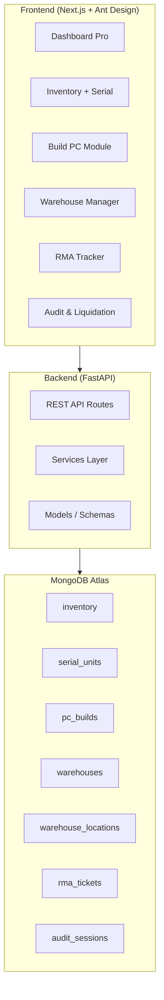
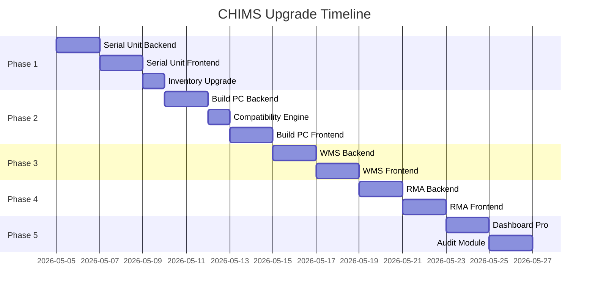

# 🖥️ CHIMS — Kế hoạch nâng cấp GearVN-Level

> **Mục tiêu**: Biến CHIMS thành hệ thống quản lý bán lẻ phần cứng chuyên nghiệp cấp doanh nghiệp, lấy cảm hứng từ quy trình vận hành của GearVN.

## 📋 Tổng quan hiện trạng

| Module | Hiện có | Cần nâng cấp |
|--------|---------|--------------|
| Inventory | ✅ SKU, Category, Stock qty | Serial Number tracking, QR/Barcode, Trạng thái hàng, Form nhập đa tầng |
| Sales | ✅ CRUD đơn hàng cơ bản | Build PC module, Kiểm tra tương thích, Tính PSU |
| Warranty | ✅ Tạo/claim BH cơ bản | Luồng RMA đầy đủ (4 bước), Tra cứu bằng Serial/SĐT, Thông báo |
| Dashboard | ✅ Stats cards, biểu đồ | Doanh thu chart, Top bán chạy, Cảnh báo hết hàng nâng cao |
| Warehouse | ❌ Chưa có | WMS: vị trí kho, chi nhánh, đồng bộ real-time |
| Audit | ❌ Chưa có | Kiểm kê, Xả kho, Cảnh báo overstock |

---

## 🏗️ Kiến trúc hệ thống mục tiêu



---

## 📦 Phase 1: Serial Number Tracking & Nhập kho nâng cao

> **Ưu tiên: CAO** — Nền tảng cho mọi module khác

### 1.1 Backend

#### New Model: `serial_unit.py`
```python
class ItemCondition(str, Enum):
    NEW = "new"           # Hàng mới
    DEMO = "demo"         # Hàng trưng bày
    RMA = "rma"           # Hàng bảo hành
    USED = "used"         # Hàng cũ

class SerialUnit:
    serial_number: str        # Duy nhất
    inventory_id: str         # FK → inventory (SPU)
    condition: ItemCondition
    status: str               # available / sold / rma / reserved
    purchase_order_id: str    # Nhập từ PO nào
    warehouse_id: str         # Đang ở kho nào
    location_code: str        # Vị trí kệ (A1-01, B2-03...)
    sold_to_order_id: str     # Bán trong đơn nào
    warranty_id: str          # Liên kết warranty
    notes: str
    created_at / updated_at
```

#### New Routes: `/api/serial-units`
| Method | Endpoint | Mô tả |
|--------|----------|-------|
| `GET` | `/` | List serial units (filter by inventory_id, status, condition, warehouse) |
| `POST` | `/` | Nhập 1 serial unit (có thể quét barcode) |
| `POST` | `/bulk` | Nhập hàng loạt serial units |
| `GET` | `/{serial}` | Tra cứu theo serial number |
| `PUT` | `/{id}` | Cập nhật trạng thái/vị trí |
| `POST` | `/scan` | Nhận barcode/QR string → trả về serial unit info |

#### Cập nhật Inventory Model
- Thêm field `product_line` (dòng sản phẩm)
- Thêm field `socket_type`, `chipset`, `form_factor` vào specs schema
- `stock_quantity` sẽ được **tính từ count serial_units có status=available** (computed)

### 1.2 Frontend

#### Trang Inventory nâng cấp
- **Form nhập đa tầng**: Brand → Product Line → Config chi tiết (Cascader)
- **Bảng serial**: Expandable row hiển thị danh sách serial units
- **Nút quét mã vạch**: Dùng camera device hoặc input barcode scanner
- **Filter nâng cao**: Lọc theo Condition (New/Demo/RMA/Used), Warehouse, Location

#### Component mới: `SerialScanner.tsx`
- Sử dụng `html5-qrcode` library
- Modal quét → auto-fill serial number
- Hỗ trợ input thủ công

---

## 🔧 Phase 2: Build PC Module (Assembly Management)

> **Ưu tiên: CAO** — USP chính của hệ thống

### 2.1 Backend

#### New Model: `pc_build.py`
```python
class PCBuildComponent:
    category: str             # CPU, GPU, RAM, Mainboard, PSU...
    inventory_id: str         # SPU reference
    serial_unit_id: str       # Specific serial unit used
    quantity: int
    unit_price: float

class PCBuild:
    build_code: str           # BUILD-0001
    build_name: str           # "Gaming Beast RTX 4070"
    components: List[PCBuildComponent]
    total_price: float
    total_tdp: int            # Tổng công suất
    recommended_psu: int      # PSU khuyến nghị
    compatibility_status: str # compatible / warning / error
    compatibility_notes: List[str]
    status: str               # draft / assembled / sold
    assembled_by: str
    created_at / updated_at
```

#### Compatibility Engine: `services/compatibility.py`
```python
SOCKET_MAP = {
    "LGA1700": ["Intel"],
    "LGA1851": ["Intel"],
    "AM5": ["AMD"],
    "AM4": ["AMD"],
}

RULES:
1. CPU socket must match Mainboard socket
2. RAM type (DDR4/DDR5) must match Mainboard support
3. Total TDP should not exceed 80% PSU wattage
4. Case form factor must fit Mainboard (ATX, mATX, ITX)
5. GPU length must fit Case max GPU length
```

#### New Routes: `/api/builds`
| Method | Endpoint | Mô tả |
|--------|----------|-------|
| `GET` | `/` | List all builds |
| `POST` | `/` | Create build (auto-check compatibility) |
| `POST` | `/check-compatibility` | Kiểm tra tương thích mà không lưu |
| `POST` | `/{id}/assemble` | Xác nhận lắp ráp → xuất kho serial units |
| `GET` | `/psu-calculator` | Tính PSU từ danh sách linh kiện |

### 2.2 Frontend

#### Trang Build PC: `/build-pc`
- **Wizard 6 bước**: CPU → Mainboard → RAM → GPU → Storage → PSU → Case → Cooling
- **Sidebar tính giá real-time**: Tổng tiền + TDP + PSU khuyến nghị
- **Cảnh báo tương thích**: Badges đỏ/vàng khi chọn sai linh kiện
- **Animation**: Component cards lật khi chọn, progress bar cho compatibility score

---

## 🏭 Phase 3: Warehouse Management System (WMS)

> **Ưu tiên: TRUNG BÌNH**

### 3.1 Backend

#### New Models
```python
class Warehouse:
    code: str           # WH-001
    name: str           # "Kho chính Quận 1"
    address: str
    type: str           # main / branch / display
    manager_id: str
    
class WarehouseLocation:
    warehouse_id: str
    location_code: str  # "A1-01" (Kệ A, Tầng 1, Ô 01)
    zone: str           # receiving / storage / display / shipping
    capacity: int
    current_count: int  # Computed
```

#### New Routes: `/api/warehouses`
| Method | Endpoint | Mô tả |
|--------|----------|-------|
| `GET` | `/` | List warehouses |
| `POST` | `/` | Create warehouse |
| `GET` | `/{id}/stock` | Stock by warehouse |
| `POST` | `/transfer` | Chuyển serial unit giữa warehouses |
| `GET` | `/stock-by-branch` | Dashboard data: tồn kho theo chi nhánh |

### 3.2 Frontend

#### Dashboard nâng cấp
- **Bản đồ kho**: Visual grid hiển thị vị trí từng kệ, mức đầy
- **Multi-branch selector**: Dropdown chọn chi nhánh → filter toàn bộ data
- **Real-time badges**: Số lượng tồn kho mỗi chi nhánh

---

## 🔄 Phase 4: RMA Process nâng cao

> **Ưu tiên: CAO** — Giữ chân khách hàng

### 4.1 Backend

#### Enhanced Warranty + RMA Model
```python
class RMAStatus(str, Enum):
    RECEIVED = "received"           # Tiếp nhận từ khách
    SENT_TO_VENDOR = "sent_to_vendor"  # Gửi hãng
    VENDOR_PROCESSING = "vendor_processing"
    RETURNED_FROM_VENDOR = "returned_from_vendor"  # Nhận lại từ hãng
    RETURNED_TO_CUSTOMER = "returned_to_customer"  # Trả khách
    REPLACED = "replaced"           # Đổi mới
    REJECTED = "rejected"           # Từ chối BH

class RMATicket:
    rma_code: str           # RMA-0001
    warranty_id: str
    serial_number: str
    customer_id: str
    issue_description: str
    status: RMAStatus
    timeline: List[RMAEvent]  # Lịch sử từng bước
    vendor_tracking: str      # Mã tracking gửi hãng
    replacement_serial: str   # Serial thay thế (nếu đổi mới)
    estimated_return_date: datetime
    notification_sent: List[dict]  # Lịch sử SMS/Email
```

#### New Routes: `/api/rma`
| Method | Endpoint | Mô tả |
|--------|----------|-------|
| `GET` | `/` | List RMA tickets |
| `POST` | `/` | Tạo RMA ticket từ warranty |
| `PUT` | `/{id}/status` | Cập nhật trạng thái (kèm ghi timeline) |
| `GET` | `/lookup` | Tra cứu bằng Serial HOẶC SĐT → trả warranty + RMA history |
| `POST` | `/{id}/notify` | Gửi thông báo cho khách |

### 4.2 Frontend

#### Trang RMA: `/rma`
- **Kanban board**: 4 cột = 4 trạng thái RMA
- **Tra cứu nhanh**: Input Serial/SĐT → popup toàn bộ lịch sử
- **Timeline**: Vertical timeline cho từng RMA ticket
- **Nút gửi thông báo**: SMS/Email template

---

## 📊 Phase 5: Audit & Liquidation + Dashboard Pro

> **Ưu tiên: TRUNG BÌNH**

### 5.1 Backend

#### New Model: `audit.py`
```python
class AuditSession:
    audit_code: str
    warehouse_id: str
    started_by: str
    status: str          # in_progress / completed / cancelled
    expected_items: int
    scanned_items: int
    discrepancies: List[dict]  # Chênh lệch
    
class LiquidationAlert:
    inventory_id: str
    reason: str          # overstock / obsolete / slow_moving
    days_in_stock: int
    suggested_discount: float
    auto_generated: bool
```

#### New Routes
| Endpoint | Mô tả |
|----------|-------|
| `/api/audit/start` | Bắt đầu phiên kiểm kê |
| `/api/audit/{id}/scan` | Quét serial trong phiên |
| `/api/audit/{id}/complete` | Hoàn thành → báo cáo chênh lệch |
| `/api/inventory/overstock-alerts` | Danh sách hàng tồn quá lâu |
| `/api/inventory/liquidation-candidates` | Hàng cần xả kho |

### 5.2 Frontend

#### Dashboard Pro nâng cấp
- **Revenue chart**: Biểu đồ doanh thu theo ngày/tuần/tháng (Recharts Area)
- **Top bán chạy**: Horizontal bar chart top 10 SKU
- **Overstock alerts**: Banner cảnh báo hàng tồn > 90 ngày
- **Donut chart**: Phân bố danh mục inventory

#### Trang Audit: `/audit`
- **Session manager**: Tạo phiên → Quét QR → So sánh kết quả
- **Discrepancy report**: Bảng highlight dòng chênh lệch (đỏ)

---

## 🗓️ Thứ tự triển khai đề xuất



---

## ❓ Câu hỏi cần bạn quyết định

1. **Bắt đầu từ Phase nào?** Khuyến nghị Phase 1 (Serial) → Phase 2 (Build PC) → Phase 4 (RMA) vì đây là 3 module có impact lớn nhất.

2. **QR/Barcode scanning**: Bạn muốn dùng camera thật (html5-qrcode) hay chỉ hỗ trợ máy quét USB (input text)?

3. **Multi-warehouse**: Bạn cần quản lý nhiều chi nhánh thật sự hay chỉ 1 kho chính?

4. **Notification**: SMS/Email thật (cần tích hợp Twilio/SendGrid) hay chỉ hiển thị trên dashboard?

5. **Triển khai tất cả 5 phase hay chọn module ưu tiên?**
